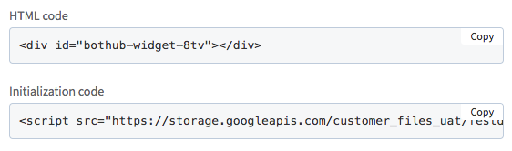

## 快速入门
您可以使用站点上的社交插件。
您能够使用事件 API 实现诸如自动发送订单回执等功能。

### 浏览器支持
此 SDK 至少支持浏览器的最新的两个版本：Chrome，Firefox，Edge，Safari（包括iOS）和Internet Explorer（仅限版本11）。  

### 初始化
Bothub SDK 没有任何需要下载或安装的独立文件，而只需要在HTML中包含一小段常规 JavaScript 代码，它们会将 SDK 异步加载到您的页面中。    
异步加载意味着它不会阻止加载页面的其他元素，随后就可以进行配置初始化了。  

以下代码片段将提供 SDK 的基本版本，其中选项设置为最常见的默认值。 您应该在要加载它的每个页面上的开始`<body>`标记之后直接插入它：

```html
<script>
window.bhAsyncInit = function() {
    window.BH.init({
        language: "en_US",
        pageId: '{your-page-id}',
        widgets: []
    });
};
</script>
<script async defer src="https://sdk.bothub.ai/dist/sdk-2-latest.js"></script>
```

初始化函数`window.BH.init`的具体解释，请看[文档](../core/init.md)。

### 使用 Bothub 后台管理
大部分用户可能都是通过 Bothub 后台管理 APP 配置的网页插件，这些用户并不需要上面这样的配置代码的过程，Bothub 会自动帮您配置好。  
初始化只需要将后台管理相关网页中看到的代码粘贴到网页中就行了。一般而言它们是长这样的：



其中`Initialization code`表示插件的初始化代码，在部署插件的时候需要将这段代码放置到页面的`&lt;head&gt;`标签内，就能完成初始化。
